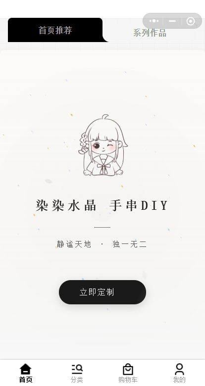
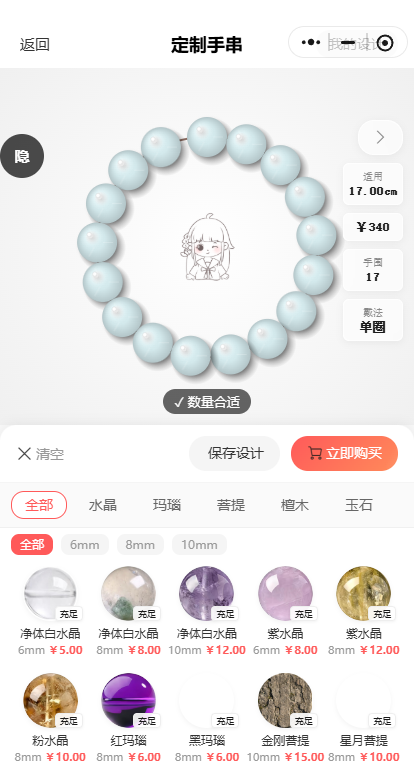
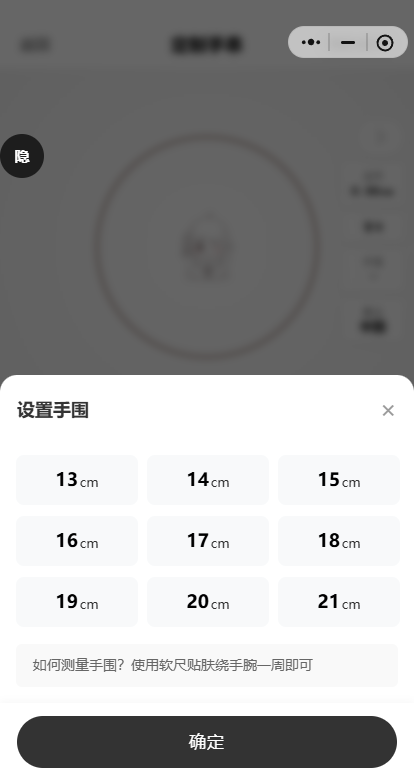
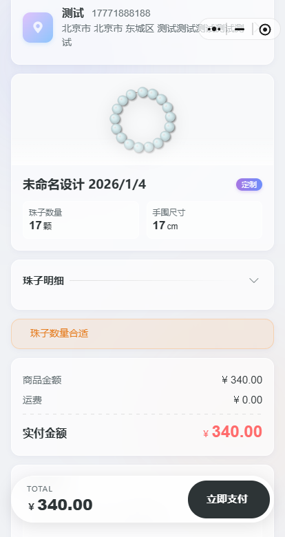
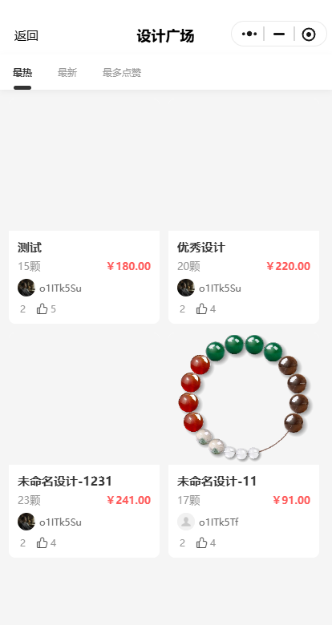
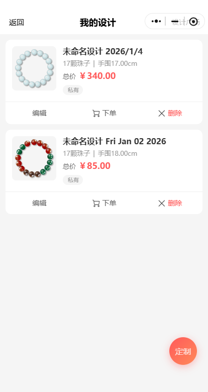
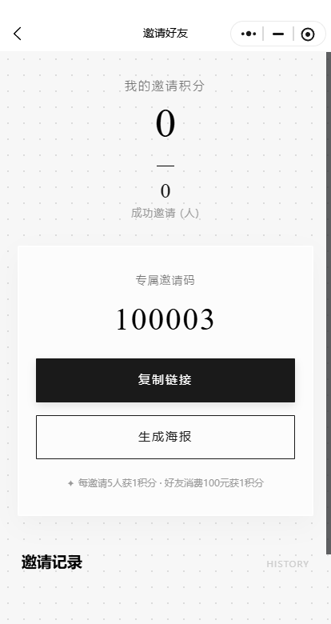

# Shouchuan - 水晶手串 DIY 定制平台

演示版：微信小程序搜索 柒柒水晶手串DIY
微信联系：lipotes
官方网站：https://rwacn.net/

## 📖 项目简介

本项目是一个专注于**水晶手串 DIY 定制**的电商平台。通过可视化的在线设计器，用户可以自由选择不同材质、尺寸的珠子进行搭配，实时预览佩戴效果，并直接下单购买。项目集成了完整的电商购物流程与用户激励体系，致力于打造“所见即所得”的个性化饰品定制体验。

## ✨ 核心亮点

### 🎨 可视化 DIY 设计器
- **自由搭配**：支持拖拽式操作，用户可自由选择和排列珠子。
- **智能算法**：根据珠子数量和尺寸动态计算手串半径，自动适配不同手围。
- **实时反馈**：实时计算方案总价，预算可控；生成高清设计图快照，方便保存与分享。

### 🛍️ 完整的电商闭环
- **便捷登录**：支持微信一键登录与手机号绑定。
- **全流程覆盖**：集成购物车、订单管理、支付（微信/支付宝）、物流追踪及售后退款等标准电商功能。
- **灵活结算**：支持普通成品商品与用户 DIY 定制商品的混合结算。

### 🔥 丰富的营销体系
- **积分系统**：签到、消费、邀请好友均可获取积分。
- **兑换机制**：积分可用于兑换稀有珠子（如积分限定款），提升用户活跃度。
- **邀请裂变**：内置完善的邀请奖励机制，通过社交分享促进用户增长。

## 🛠️ 技术栈

本项目采用主流的前后端分离架构开发，具有良好的扩展性与维护性：

- **移动端**：基于 **UniApp (Vue 3)** 开发，一套代码可编译发布至微信小程序、H5 及 Android/iOS App。
- **服务端**：基于 **ThinkPHP** 框架构建，提供稳定高效的 RESTful API 服务。
- **管理后台**：基于 **Vue** 生态构建的独立后台管理系统，实现商品、订单及用户的全方位管理。
- **数据库**：MySQL 5.7+。

## 🚀 未来规划

我们计划在后续版本中持续提升用户体验与互动性：

- [ ] **3D 沉浸式体验**：引入 Web 3D 引擎，真实还原水晶材质的光泽与通透感。
- [ ] **AR 试戴**：结合 AR 技术，利用手机摄像头实现手腕实时试戴预览。
- [ ] **设计广场**：打造用户社区，支持设计方案的公开发布、点赞互动及“一键同款”购买。
- [ ] **多品类扩展**：增加多圈手串（如108颗佛珠）、项链等复杂饰品的定制支持。

---

*如果您觉得本项目对您有帮助，欢迎 Star ⭐️ 支持！*
